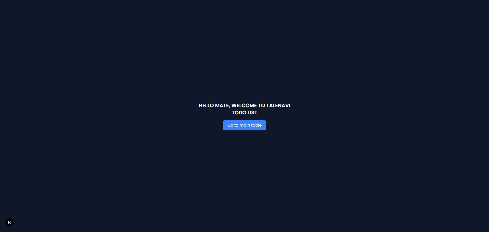

# TALENAVI TECHNICAL TEST

This website was created to meet the technical test needs provided by the Talenavi team.

# HOW TO RUN THE WEBSITE

1. Clone the repository to your local machine.
2. Navigate to the project directory.
3. Run the following command to install the required dependencies:

   ```bash
   npm install
   ```

4. Create a `.env` file in the root directory and add the following environment variables:
   ```bash
   API_URL=http://localhost:3000/api
   ```
   Note: You can change the `API_URL` to your desired API URL.
5. After the installation is complete, run the following command to start the development server:
   ```bash
   npm run dev
   ```
6. Open your web browser and go to `http://localhost:3000` to view the website.

# PREVIEW WEBSITE




# TECHNOLOGIES USED

NEXT JS, TYPESCRIPT, TAILWIND CSS, SHADCN UI

# AUTHOR

**Name**: [Rinaldi Ihsan Setiawan]
